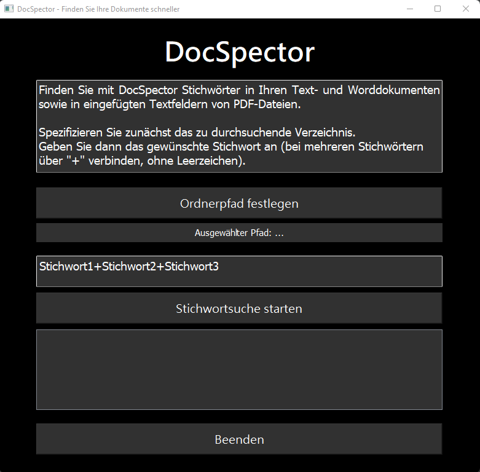

# DocSpector
## Stichwortfinder für Texte in Dokumenten

von Eric Schöbel

**DocSpector** ist eine auf PyQt5 basierende Desktop-Anwendung, die dazu entwickelt wurde, in verschiedenen Dokumenttypen innerhalb eines angegebenen Verzeichnisses nach Stichwörtern zu suchen. Die Anwendung unterstützt Textdateien, Microsoft Word-Dokumente und Kommentare in PDF-Dateien. Benutzer können ein Verzeichnis zur Suche angeben und Stichwörter eingeben, um Dokumente zu finden, die diese Stichwörter enthalten.

**Features**

 + Verzeichnisauswahl: Ermöglicht es den Benutzern, einen Ordner mit zu durchsuchenden Dokumenten auszuwählen. Dabei wird der Inhalt der Dokumente eingeladen.
 + Stichwortsuche: Benutzer können potenziell mehrere Stichwörter, getrennt durch ein '+'-Zeichen, eingeben, um innerhalb der Dokumente zu suchen.
 + Ergebnisanzeige: Zeigt die Dateinamen und gefundenen Stichwörter in einer Tabellenansicht an.
 + Benutzeroberfläche: Eine elegante, dunkel gehaltene Oberfläche mit klaren Anweisungen auf den Schaltflächen.

**Anwendung**

Das Programm ist in *Python* geschrieben. Eine ausführbare Version kann [hier](https://github.com/EricSchoebel/DocSpector/releases) heruntergeladen werden.

Abzug der Oberfläche:

